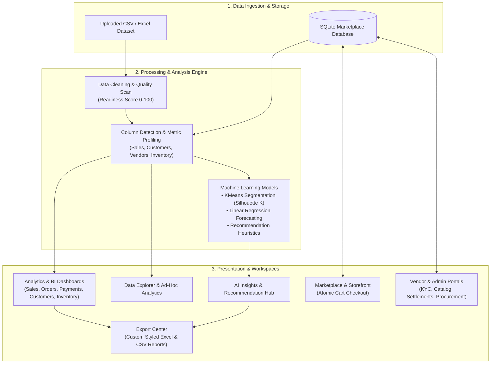

# Customer Insights Platform

> **A full-stack, role-based business intelligence, machine learning, and multi-vendor marketplace platform built in Python and Streamlit.**

[](https://www.python.org/)
[](https://streamlit.io/)
[](https://pandas.pydata.org/)
[](https://plotly.com/)
[](https://scikit-learn.org/)
[](https://www.sqlite.org/)
[](https://docs.pytest.org/)
[](LICENSE)

---

## 📌 Table of Contents

- [Project Overview](#-project-overview)
- [Key Capabilities](#-key-capabilities)
  - [1. Data Ingestion & Quality Engine](#1-data-ingestion--quality-engine)
  - [2. Multi-Dimensional Analytics & BI](#2-multi-dimensional-analytics--bi)
  - [3. Customer Intelligence & Segmentation](#3-customer-intelligence--segmentation)
  - [4. AI Insights & Recommendation Engine](#4-ai-insights--recommendation-engine)
  - [5. Multi-Tenant Marketplace & Operations](#5-multi-tenant-marketplace--operations)
  - [6. Enterprise Reporting & Data Export](#6-enterprise-reporting--data-export)
- [Application Workflow](#-application-workflow)
- [System Architecture](#-system-architecture)
- [Role-Based Access Control (RBAC)](#-role-based-access-control-rbac)
- [Dual-Source Analytics Engine](#-dual-source-analytics-engine)
- [Repository Structure](#-repository-structure)
- [Getting Started](#-getting-started)
  - [Prerequisites](#prerequisites)
  - [Installation](#installation)
  - [Database Initialization & Demo Data](#database-initialization--demo-data)
  - [Running the Application](#running-the-application)
- [Testing & Quality Assurance](#-testing--quality-assurance)
- [Technology Stack](#-technology-stack)
- [License](#-license)

---

## 📖 Project Overview

The **Customer Insights Platform** is an enterprise-grade analytics suite and e-commerce marketplace management system. It bridges the gap between **raw transactional data** and **strategic business decisions** by combining self-service dataset preparation, interactive business intelligence, unsupervised machine learning, and a live multi-tenant storefront.

### The Problem It Solves
- **Fragmented Data**: Businesses frequently struggle with dirty, unstructured CSVs that distort customer retention, revenue totals, and inventory health.
- **Static Reporting**: Traditional reporting is siloed and decoupled from real-time operational workflows like inventory restocking and vendor commission payouts.
- **Complex Analytics Setup**: Small-to-medium enterprises and analysts often lack unified tools to perform automated data cleaning, RFM scoring, customer clustering, and trend forecasting without engineering custom pipelines.

### Target Audience
- **Business Analysts & Data Engineers**: Ingest raw datasets, run automated data quality scans, explore multidimensional cohorts, and train segmentation models.
- **Operations & Marketplace Managers**: Supervise vendor onboarding, review catalog pricing, manage procurement reorders, and execute commission settlements.
- **Vendors & Merchants**: Track real-time product inventory, monitor order fulfillment status, and review net payouts with transparent commission deductions.
- **Executives & Decision Makers**: Access high-level risk diagnostics, executive summaries, and exportable presentation-ready Excel reports.

---

## 🚀 Key Capabilities

### 1. Data Ingestion & Quality Engine
- **Multi-Format Ingestion**: Upload custom `.csv`, `.xlsx`, and `.xls` files or query the live relational marketplace database.
- **Automated Column Heuristics**: Dynamic keyword-matching engine automatically identifies dimensions (`customer`, `order`, `revenue`, `date`, `product`, `category`, `region`, `status`, `stock`, `rating`).
- **Dataset Health Scoring**: Calculates an automated data readiness score ($0 - 100$) based on missing values, duplicate records, and column variances.
- **One-Click Preprocessing**: Cleans corrupt records, drops duplicate rows, and standardizes data types before downstream analytics.

### 2. Multi-Dimensional Analytics & BI
- **Sales Analytics**: Historical revenue tracking, Period-over-Period growth %, Average Order Value (AOV), and category/regional distribution.
- **Order Analytics**: Order volume breakdown, fulfillment tracking, cancellation rates, and delivery timeline metrics.
- **Payment Analytics**: Gross revenue by payment mode, transaction success rates, and settlement status breakdowns.
- **Inventory Analytics**: Catalog valuation, out-of-stock monitoring, low-stock threshold alerts ($< 10$ units), and reorder status.
- **Product & Vendor Analytics**: Top-performing SKU ranking, vendor revenue contributions, and seller rating distributions.
- **Data Explorer**: Ad-hoc analytics workbench with automatic identifier exclusion, statistical summaries (mean, median, quantiles, std dev), top-N grouping, and dynamic Plotly visualizations.

### 3. Customer Intelligence & Segmentation
- **Rule-Based RFM Profiling**: Automatically computes **Recency** (days since last purchase), **Frequency** (order count), and **Monetary** (gross spend) scores from transactional records.
- **Behavioral Cohort Classification**: Maps customers into distinct behavioral segments:
  - 🏆 *Champions*
  - 💎 *Loyal Customers*
  - 🚀 *Potential Loyalists*
  - ⚠️ *At Risk*
  - 🛒 *One-Time Customers*
  - 🔍 *Needs Attention*
- **Revenue Concentration Analysis**: Calculates top-10% customer revenue share and repeat purchase ratios to identify account risk.
- **ML Customer Segmentation**: Unsupervised **K-Means Clustering** featuring:
  - Feature normalization via `StandardScaler`.
  - Automated optimal cluster search ($K = 2$ to $8$) using **Silhouette Score** maximization.
  - Value-ranked cluster labeling (*Premium*, *Loyal*, *Regular*, *Occasional*, *At Risk*).

### 4. AI Insights & Recommendation Engine
- **Executive Risk Scanner**: Automated rule-based diagnostic engine flagging critical business risks (low inventory levels, elevated order return rates, payment failure spikes, and churn hazards).
- **Linear Trend Forecasting**: Next-period revenue forecasting via `LinearRegression` with slope-based trend classification (*Upward*, *Downward*, *Flat*) and $R^2$ confidence indicators.
- **Algorithmic Product Recommendations**: Generates 6 distinct product recommendation types with deterministic confidence scoring (weighted by Sales Volume 40%, Inventory Health 30%, and Category/Vendor Similarity 30%):
  1. 🔄 **Frequently Bought Together** (Market basket co-occurrence analysis)
  2. 🔀 **Cross-Sell Opportunities** (Customer purchase overlap)
  3. 🔥 **Trending Products** (Sales velocity rankings)
  4. 📦 **Low-Stock Alternatives** (Healthy in-stock substitutes within the same category)
  5. ⬆️ **Upsell Opportunities** (Premium category alternatives)
  6. 🏷️ **Similar Products** (Vendor and category clustering)

### 5. Multi-Tenant Marketplace & Operations
- **Storefront & Catalog**: Customer-facing product catalog with search, category filtering, and real-time stock indicators.
- **Atomic Checkout**: Transactional checkout engine (`BEGIN TRANSACTION` / `COMMIT` / `ROLLBACK`) that ensures ACID compliance, creates orders (`ORD-...`), records line items, and decrements inventory atomically.
- **Vendor Onboarding & KYC**: Self-serve vendor registration portal capturing GST numbers, address, owner details, and business category with Admin approval workflows (*Pending*, *Approved*, *Suspended*).
- **Vendor Management Portal**: Dedicated portal for approved vendors to manage product listings, update inventory, fulfill order items, and view payment settlements.
- **Automated Settlement Engine**: Computes vendor gross sales, commission deductions, and net payouts on settled orders.
- **Procurement Reordering**: Dedicated procurement workflow to restock inventory and configure reorder levels.

### 6. Enterprise Reporting & Data Export
- **Consolidated Excel Reports**: Generates professional multi-section `.xlsx` reports styled via `openpyxl` with executive KPI cards, summary tables, and actionable bullet points.
- **Domain-Specific Reports**: Standalone report generation for Marketplace, Vendor Performance, Customer Intelligence, Inventory, and Financial Settlements.
- **CSV Data Exports**: Export raw and processed tables across all analytics pages for downstream tools.

---

## 🔄 Application Workflow



---

## 🏗️ System Architecture

The project follows a **layered, decoupled architectural pattern** separating UI presentation, business orchestration, and database access:

```text
┌────────────────────────────────────────────────────────┐
│                   Streamlit UI Layer                   │
│         (app.py, modules/, components/, assets/)        │
└───────────────────────────┬────────────────────────────┘
                            │ Calls
┌───────────────────────────▼────────────────────────────┐
│                  Business Service Layer                │
│         (services/, utils/ml_models.py, utils/etl)     │
│   • Transaction Management  • Commission Calculation   │
│   • Inventory Validation    • ML Clustering/Forecast   │
└───────────────────────────┬────────────────────────────┘
                            │ Parameterized Queries
┌───────────────────────────▼────────────────────────────┐
│                  Repository / Data Layer               │
│         (database/ repositories, connection.py)        │
│   • Pure SQL Execution      • Schema Migrations        │
└───────────────────────────┬────────────────────────────┘
                            │ Persists
┌───────────────────────────▼────────────────────────────┐
│                    SQLite Database                     │
│                     (analytics.db)                     │
└────────────────────────────────────────────────────────┘
```

### Architectural Layer Responsibilities
- **`modules/` (Presentation)**: Pure Streamlit views, forms, metric tiles, and Plotly charts. Handles UI state (`st.session_state`) and delegates actions to services.
- **`services/` (Business Logic)**: Transaction boundaries (`BEGIN TRANSACTION`, `COMMIT`, `ROLLBACK`), commission math, inventory checks, exception handling.
- **`database/` (Data Access)**: Repository pattern containing pure, parameterized SQL queries with zero UI code.
- **`utils/` (Core Computing & ML)**: Algorithmic customer metrics (RFM), heuristic column matching, KMeans clustering, linear regression forecasting, recommendation engine, styling tokens, and caching.
- **`core/` (Cross-Cutting)**: Centralized logging, domain-specific exception definitions (`InventoryError`, `DatabaseError`), and error handlers.
- **`auth/` (Security)**: Password hashing with `bcrypt` salt rounds, verification, and user credential persistence.

---

## 🔐 Role-Based Access Control (RBAC)

The platform provides fine-grained access control across 5 primary user roles:

| Module / Feature | Admin | Manager | Business Analyst | Vendor | Guest / Customer |
| :--- | :---: | :---: | :---: | :---: | :---: |
| **Marketplace Storefront & Checkout** | ✅ | ✅ | ✅ | ✅ | ✅ |
| **Vendor Self-Registration** | — | — | — | ✅ | ✅ |
| **Executive Dashboard & BI** | ✅ | ✅ | ✅ | — | — |
| **Dataset Upload & Cleaning** | ✅ | — | ✅ | — | — |
| **Dataset Library Management** | — | ✅ | — | — | — |
| **Ad-Hoc Data Explorer** | ✅ | — | ✅ | — | — |
| **Customer, Sales & Payment Analytics** | ✅ | — | ✅ | — | — |
| **AI Insights & Recommendations** | ✅ | — | ✅ | — | — |
| **Vendor & KYC Approval** | ✅ | — | ✅ | — | — |
| **Procurement & Inventory Oversight** | ✅ | — | ✅ | — | — |
| **Vendor Portal (Products, Orders, Stock)**| — | — | — | ✅ *(Approved)* | — |
| **Financial & Management Reports** | ✅ | ✅ | ✅ | ✅ *(Scoped)* | — |

---

## 💾 Dual-Source Analytics Engine

The platform operates on a flexible dual-source data architecture:

```text
┌──────────────────────────────────────┐       ┌──────────────────────────────────────┐
│        Live Database Source          │       │        Uploaded File Source          │
│       (SQLite: analytics.db)         │       │          (CSV / Excel File)          │
├──────────────────────────────────────┤       ├──────────────────────────────────────┤
│ • Real-time operational orders       │       │ • Ad-hoc dataset exploration         │
│ • Live vendor catalog & inventory    │  OR   │ • Custom customer transactional logs │
│ • Customer checkouts & settlements   │       │ • Historical sales files             │
└──────────────────┬───────────────────┘       └──────────────────┬───────────────────┘
                   │                                              │
                   └───────────────────────┬──────────────────────┘
                                           ▼
                       ┌──────────────────────────────────────┐
                       │      Unified Profiling Pipeline      │
                       │    (utils/customer_metrics.py)       │
                       └──────────────────────────────────────┘
```

1. **Live Marketplace Mode**: Directly extracts, aggregates, and visualizes orders, vendors, products, and settlements created in the application.
2. **Uploaded Dataset Mode**: Ingests external enterprise CSVs/Excel sheets, computes dataset readiness, detects schema structure, and produces analytical insights.

---

## 📁 Repository Structure

```text
Customer Insights Platform/
├── app.py                          # Application entry point, routing & session initialization
├── requirements.txt                # Dependency manifest
├── seed_demo_data.py               # Synthetic database seeder (120 vendors, 10k orders)
├── LICENSE                         # MIT License
├── assets/
│   └── style.css                   # Custom CSS styling tokens and layout rules
├── auth/
│   └── auth_utils.py               # Bcrypt password hashing & authentication helpers
├── components/
│   └── recommendation_card.py      # Custom HTML/CSS cards for product recommendations
├── config/
│   ├── constants.py                # Global application constants
│   ├── demo_seed.py                # Seed configuration parameters
│   ├── navigation.py               # Dynamic RBAC sidebar navigation renderer
│   ├── order_status.py             # Order lifecycle state definitions
│   ├── payment_status.py           # Payment transaction status constants
│   ├── roles.py                    # Role definitions (Admin, Manager, Analyst, Vendor, Guest)
│   └── uploads.py                  # File upload size limits and MIME types
├── core/
│   ├── error_handler.py            # Global exception handling decorators
│   ├── exceptions.py               # Domain exceptions (InventoryError, RepositoryError)
│   └── logger.py                   # Centralized application logging configuration
├── database/
│   ├── connection.py               # SQLite thread-safe connection provider
│   ├── database.py                 # Core database helpers and metadata accessors
│   ├── migration.py                # Automated schema builder & table migration script
│   ├── customer_repository.py      # Customer CRUD queries
│   ├── dataset_repository.py       # Uploaded dataset metadata queries
│   ├── inventory_repository.py     # Product stock & reorder queries
│   ├── order_repository.py         # Order creation & status update queries
│   ├── payment_repository.py       # Payment tracking & commission queries
│   ├── product_repository.py       # Catalog & SKU queries
│   ├── settlement_repository.py    # Vendor settlement & payout queries
│   └── vendor_repository.py        # Vendor profile & KYC verification queries
├── datasets/                       # Local directory for uploaded/published user CSVs
├── docs/                           # Architectural, Database, Deployment & Testing specs
├── modules/                        # Presentation Views (Streamlit Pages)
│   ├── admin_customers.py          # Customer CRM management
│   ├── admin_inventory.py          # Marketplace catalog & procurement workflows
│   ├── admin_settlements.py        # Commission payout reconciliation
│   ├── admin_vendors.py            # Vendor KYC approvals & rate configuration
│   ├── ai_insights.py              # Executive risk scanner & recommendation hub
│   ├── analysis.py                 # Ad-hoc multidimensional Data Explorer
│   ├── analytics_customer.py       # RFM segmentation & customer intelligence
│   ├── analytics_inventory.py      # Stock valuation & low-stock dashboards
│   ├── analytics_order.py          # Order volume & fulfillment dashboards
│   ├── analytics_payment.py        # Payment method & transaction success dashboards
│   ├── analytics_product.py        # Product sales velocity & category rankings
│   ├── analytics_sales.py          # Revenue trends & growth analytics
│   ├── analytics_vendor.py         # Vendor contribution & rating analytics
│   ├── checkout.py                 # Multi-item transactional checkout page
│   ├── cleaning.py                 # Data quality, health scoring & preprocessing
│   ├── dashboard.py                # Unified executive KPI overview
│   ├── export.py                   # Single-document Excel report generator
│   ├── library.py                  # Manager dataset catalog & published datasets
│   ├── login.py                    # User authentication interface
│   ├── marketplace.py              # Public marketplace storefront & shopping cart
│   ├── report_center.py            # Modular multi-domain report exporter
│   ├── signup.py                   # User registration view
│   ├── user_management.py          # User role administration
│   ├── vendor_dashboard.py         # Merchant analytics & sales KPIs
│   ├── vendor_inventory.py         # Merchant stock level management
│   ├── vendor_orders.py            # Merchant order fulfillment tracking
│   ├── vendor_payments.py          # Merchant commission & payout history
│   ├── vendor_products.py          # Merchant product catalog & SKU creation
│   ├── vendor_profile.py           # Merchant business details management
│   ├── vendor_registration.py      # Self-serve vendor onboarding form
│   ├── vendor_status_page.py       # Vendor onboarding pending/suspended screen
│   └── reports/                    # Report content builder sub-modules
│       ├── customer_report.py
│       ├── inventory_report.py
│       ├── order_report.py
│       ├── payment_report.py
│       ├── product_report.py
│       ├── report_utils.py
│       ├── sales_report.py
│       └── vendor_report.py
├── services/                       # Business Logic Layer (Orchestration & Rules)
│   ├── checkout_service.py         # Atomic checkout, inventory deduction, order placement
│   ├── inventory_service.py        # Stock additions, updates, threshold enforcement
│   ├── marketplace_dataset_service.py # Live DB to DataFrame conversion service
│   ├── marketplace_service.py      # Storefront queries & filtering
│   ├── order_service.py            # Order lifecycle and status transitions
│   ├── payment_service.py          # Payment processing & status handling
│   ├── settlement_service.py       # Commission deduction & payout calculation
│   └── vendor_service.py           # Vendor profile & KYC verification workflows
├── tests/                          # Automated Pytest Suite (Mocked DB & Services)
│   ├── test_checkout.py
│   ├── test_inventory.py
│   ├── test_marketplace.py
│   ├── test_payment.py
│   └── test_vendor.py
└── utils/                          # Computing, ML & UI Utilities
    ├── cache.py                    # In-memory metric caching helper
    ├── customer_metrics.py         # RFM calculation, heuristic column detection & profiling
    ├── data_source_helper.py       # Dual-source data resolver (Live DB vs Uploaded CSV)
    ├── etl_pipeline.py             # Schema detection, data cleaning & preprocessing
    ├── ml_models.py                # KMeans clustering, Linear forecasting & recommendations
    ├── ui_components.py            # Reusable Streamlit card, tile & grid renderers
    ├── ui_constants.py             # Color palettes, icon maps, typographic scales
    └── ui_helpers.py               # Readiness score math, toast notifications & spinners
```

---

## ⚡ Getting Started

### Prerequisites
- **Python 3.9+** (Tested on Python 3.9, 3.10, 3.11, 3.12, 3.14)
- **Git**

### Installation

1. **Clone the repository**:
   ```bash
   git clone https://github.com/Yash-Verma-721/Customer-Insights-Platform.git
   cd Customer-Insights-Platform
   ```

2. **Create and activate a virtual environment**:
   - **Linux / macOS**:
     ```bash
     python3 -m venv venv
     source venv/bin/activate
     ```
   - **Windows (PowerShell)**:
     ```powershell
     python -m venv venv
     .\venv\Scripts\Activate.ps1
     ```

3. **Install dependencies**:
   ```bash
   pip install -r requirements.txt
   ```

### Database Initialization & Demo Data

The application automatically initializes the SQLite schema (`users.db` / `analytics.db`) on startup.

*(Optional)* To populate the database with a complete synthetic enterprise dataset (120 vendors, 1,000 customers, 3,500 products, and 10,000 orders):
```bash
python seed_demo_data.py
```

### Running the Application

Launch the Streamlit web application:
```bash
streamlit run app.py
```

Open your browser and navigate to:
```text
http://localhost:8501
```

---

## 🧪 Testing & Quality Assurance

The platform includes an automated unit testing suite utilizing `pytest` and `unittest.mock` to validate the **Service Layer** and business rules without executing uncommitted physical database writes.

Run the test suite:
```bash
pytest tests/
```

### Tested Scenarios
- **Atomic Checkout**: Cart processing, stock availability verification, inventory deduction, and transaction commits.
- **Inventory Control**: Ownership checks, stock increment/decrement, and reorder threshold validation.
- **Vendor Operations**: Profile updates, KYC workflows, and duplicate business name integrity.
- **Settlement & Commission**: Payout math, commission percentage deductions, and status changes.

---

## 🛠️ Technology Stack

| Layer / Domain | Technologies & Libraries |
| :--- | :--- |
| **Core Language** | Python 3.9+ |
| **Web Framework & UI** | [Streamlit](https://streamlit.io/) (Wide layout, responsive session routing) |
| **Data Processing & ETL**| [Pandas](https://pandas.pydata.org/), [NumPy](https://numpy.org/) |
| **Interactive Visualizations** | [Plotly Express](https://plotly.com/python/) |
| **Machine Learning** | [Scikit-Learn](https://scikit-learn.org/) (`KMeans`, `StandardScaler`, `silhouette_score`, `LinearRegression`) |
| **Spreadsheet Reporting**| [OpenPyXL](https://openpyxl.readthedocs.io/) (Multi-sheet, custom styling, cell formatting) |
| **Database & Persistence** | [SQLite3](https://www.sqlite.org/) (Thread-safe connection pooling, automated migrations) |
| **Security & Auth** | [BCrypt](https://pypi.org/project/bcrypt/) (Salted password hashing) |
| **Testing & Mocking** | [Pytest](https://docs.pytest.org/), `unittest.mock` |
| **Synthetic Seeding** | [Faker](https://faker.readthedocs.io/) |

---

## 📄 License

This project is open-source software licensed under the **[MIT License](LICENSE)**.

Copyright (c) 2026 **Yash Verma**.
